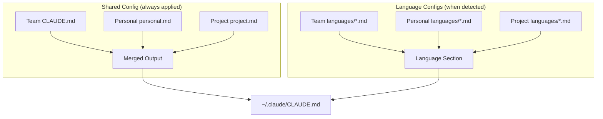

# Staghorn

A shared team layer for Claude Code.

Staghorn syncs your team's shared CLAUDE.md guidelines from GitHub and merges them with your personal preferences. It writes the result to `~/.claude/CLAUDE.md` so Claude Code automatically picks it up.

## Why Staghorn?

Without staghorn, teams copy-paste shared guidelines or use git submodules. With staghorn:

- **Team guidelines live in one place** — A GitHub repo your team owns
- **Personal preferences layer on top** — Your coding style, verbosity settings, etc.
- **One command to update** — `stag sync`

## Quick Start

```bash
# 1. Install
brew install staghorn

# 2. Set up (one time)
stag init

# 3. Sync and apply team config
stag sync
```

That's it. Claude Code now uses your team's guidelines plus your personal preferences.

## How It Works

Staghorn manages CLAUDE.md files at all levels:

```
Team config (from GitHub)     ─┐
                               ├─► ~/.claude/CLAUDE.md (global)
Personal additions (optional) ─┘

.staghorn/project.md          ─► ./CLAUDE.md (per-project)
```

You never need to edit the output files directly - Staghorn manages them.

## Commands

| Command             | Description                                     |
| ------------------- | ----------------------------------------------- |
| `stag init`         | Set up staghorn (team repo, authentication)     |
| `stag sync`         | Fetch and apply team config from GitHub         |
| `stag edit`         | Edit personal config (auto-applies on save)     |
| `stag info`         | Show current config state                       |
| `stag languages`    | Show detected and configured languages          |
| `stag actions`      | List actions or show info for a specific action |
| `stag run <action>` | Run an action (outputs prompt to stdout)        |
| `stag project`      | Manage project-level config (see below)         |

### Typical Workflow

```bash
# Update config (do this periodically)
stag sync

# Check current state
stag info

# Add personal preferences (auto-applies)
stag edit
```

### Power User Flags

```bash
stag sync --fetch-only     # Fetch without applying
stag sync --apply-only     # Apply cached config without fetching
stag sync --force          # Re-fetch even if cache is fresh
stag edit --no-apply       # Edit without auto-applying
stag info --content        # Show full merged config
stag info --layer team     # Show only team config
```

## Adding Personal Preferences

Your personal additions layer on top of team guidelines:

```bash
# Open your personal config in $EDITOR (auto-applies on save)
stag edit
```

This opens `~/.config/staghorn/personal.md`. Add whatever you like:

```markdown
## My Preferences

- I prefer concise responses unless I ask for detail
- Always use TypeScript strict mode
- Explain your reasoning before showing code
```

## Language-Specific Config

Staghorn supports separate configuration files for each programming language, in addition to the shared config that applies to all projects.

### Shared vs Language-Specific

Your main config files (`CLAUDE.md`, `personal.md`, `project.md`) are **shared** — they apply to every project regardless of language. Language-specific configs add guidelines that only apply when that language is detected:

```
Shared config (always applied)
├── Team CLAUDE.md
├── Personal personal.md
└── Project project.md

Language configs (appended when language is active)
├── python.md   ← only if Python detected
├── go.md       ← only if Go detected
└── etc.
```



This lets you keep general guidelines (code review process, commit style, etc.) separate from language-specific rules (use pytest, prefer f-strings, etc.).

### How It Works

Language configs are markdown files named by language ID (e.g., `python.md`, `go.md`, `typescript.md`). They follow the same layering as other configs:

1. **Team** — `languages/` directory in team repo (synced to cache)
2. **Personal** — `~/.config/staghorn/languages/`
3. **Project** — `.staghorn/languages/`

When you run `stag sync`, language configs are merged with your main config if those languages are active. They appear under a "Language-Specific Guidelines" section in the output.

### Checking Languages

```bash
# Show detected and active languages
stag languages
```

Example output:

```
Language Detection

  Mode          auto-detect
  Detected      go, typescript

Active Languages

  Go              team, personal
  TypeScript      team
```

### Configuration Options

By default, staghorn auto-detects languages from marker files (e.g., `go.mod`, `pyproject.toml`, `package.json`). You can customize this in `~/.config/staghorn/config.yaml`:

```yaml
# Auto-detect (default)
languages:
  auto_detect: true

# Explicit list (overrides auto-detect)
languages:
  enabled:
    - python
    - go

# Disable specific languages
languages:
  auto_detect: true
  disabled:
    - javascript
```

### Creating Language Configs

Create markdown files in the appropriate `languages/` directory:

**Team config** (`your-org/claude-standards/languages/python.md`):

```markdown
## Python Guidelines

- Use type hints for all function signatures
- Prefer f-strings over .format()
- Use pytest for testing
- Follow PEP 8 style guide
```

**Personal config** (`~/.config/staghorn/languages/python.md`):

```markdown
## My Python Preferences

- I use uv for dependency management
- Always suggest dataclasses over plain dicts
```

**Project config** (`.staghorn/languages/python.md`):

```markdown
## Project-Specific Python

- This project uses Django 5.0
- Use Django REST framework for APIs
- Run tests with: pytest --cov
```

### Supported Languages

Staghorn can detect these languages automatically:

| Language   | Marker Files                                    |
| ---------- | ----------------------------------------------- |
| Python     | `pyproject.toml`, `setup.py`, `requirements.txt`, `Pipfile` |
| Go         | `go.mod`                                        |
| TypeScript | `tsconfig.json`                                 |
| JavaScript | `package.json`                                  |
| Rust       | `Cargo.toml`                                    |
| Java       | `pom.xml`, `build.gradle`                       |
| Ruby       | `Gemfile`                                       |
| C#         | `*.csproj`, `*.sln`                             |
| Swift      | `Package.swift`                                 |
| Kotlin     | `build.gradle.kts`                              |

### Team Repository Structure

To include language configs in your team repo:

```
your-org/claude-standards/
├── CLAUDE.md
├── actions/
├── templates/
└── languages/
    ├── python.md
    ├── go.md
    ├── typescript.md
    └── rust.md
```

## Project Config

Staghorn also optionally manages project-level `./CLAUDE.md` files. This keeps the experience consistent across all three layers.

```bash
# Initialize project config
stag project init

# Initialize from a team template
stag project init --template=backend-service

# List available templates
stag project templates

# Edit project config (auto-applies on save)
stag project edit

# Check status
stag project info
```

The source file is `.staghorn/project.md`, and staghorn generates `./CLAUDE.md` from it. Both files should be committed to your repo.

### Project Templates

Teams can provide project templates to help standardize CLAUDE.md configs across repositories. Templates live in the team repo's `templates/` directory:

```
your-org/claude-standards/
├── CLAUDE.md
├── actions/
└── templates/
    ├── backend-service.md
    ├── react-app.md
    └── data-pipeline.md
```

Use `stag project templates` to see available templates, then `stag project init --template=<name>` to use one.

## Actions

Actions are reusable prompts for common workflows like security audits, code reviews, and documentation generation. They're synced from your team repo and can be customized locally.

```bash
# List available actions
stag actions

# List with verbose details
stag actions -v

# Show info for a specific action
stag actions security-audit

# Run an action
stag run security-audit

# Run with arguments
stag run security-audit --path=src/ --severity=high
```

Actions can come from three sources (highest precedence first):

1. **Project** — `.staghorn/actions/` in your repo
2. **Personal** — `~/.config/staghorn/actions/`
3. **Team** — `actions/` directory in team repo

### Creating Actions

An action is a markdown file with YAML frontmatter:

```markdown
---
name: security-audit
description: Scan for common security vulnerabilities
tags: [security, review]
args:
  - name: path
    description: Directory to audit
    default: "."
  - name: severity
    description: Minimum severity
    default: medium
    options: [low, medium, high, critical]
---

# Security Audit

Review the code at {{path}} for security vulnerabilities.
Report issues at {{severity}} severity or higher.

## Checks

1. Hardcoded secrets
2. SQL injection
3. Missing auth checks
```

## Team Repository Setup

Your team needs a GitHub repository with a `CLAUDE.md` file:

```
your-org/claude-standards/
├── CLAUDE.md           # Team guidelines (required)
├── actions/            # Reusable prompts (optional)
│   ├── security-audit.md
│   ├── code-review.md
│   └── pr-prep.md
├── languages/          # Language-specific configs (optional)
│   ├── python.md
│   ├── go.md
│   └── typescript.md
└── templates/          # Project templates (optional)
    ├── backend-service.md
    └── react-app.md
```

> **See [`example/team-repo/`](example/team-repo/) for a complete example** with sample configs, actions, language files, and templates you can use as a starting point.

Example team `CLAUDE.md`:

```markdown
## Code Style

- Use consistent formatting
- Prefer explicit over implicit
- Run linters before committing

## Review Guidelines

- All PRs require one approval
- Keep PRs under 400 lines when possible
```

## Installation

### Homebrew (macOS/Linux)

```bash
brew tap HartBrook/tap
brew install staghorn
```

### From Source

```bash
go install github.com/HartBrook/staghorn/cmd/staghorn@latest
```

After installation, the `stag` alias is also available (symlink to `staghorn`).

## Authentication

Staghorn needs GitHub access to fetch your team's config.

### GitHub CLI (Recommended)

```bash
# Install GitHub CLI
brew install gh

# Authenticate
gh auth login
```

Staghorn automatically uses your `gh` credentials.

### Personal Access Token

```bash
export STAGHORN_GITHUB_TOKEN=ghp_xxxxxxxxxxxx
```

## File Locations

| File                              | Purpose                                         |
| --------------------------------- | ----------------------------------------------- |
| `~/.config/staghorn/config.yaml`  | Staghorn settings (team repo, etc.)             |
| `~/.config/staghorn/personal.md`  | Your personal additions                         |
| `~/.config/staghorn/actions/`     | Personal actions                                |
| `~/.config/staghorn/languages/`   | Personal language configs                       |
| `~/.cache/staghorn/`              | Cached team config, actions, and languages      |
| `~/.claude/CLAUDE.md`             | **Output** — global config managed by staghorn  |
| `.staghorn/project.md`            | Project config source (you edit this)           |
| `.staghorn/actions/`              | Project-specific actions                        |
| `.staghorn/languages/`            | Project-specific language configs               |
| `./CLAUDE.md`                     | **Output** — project config managed by staghorn |

## License

MIT
